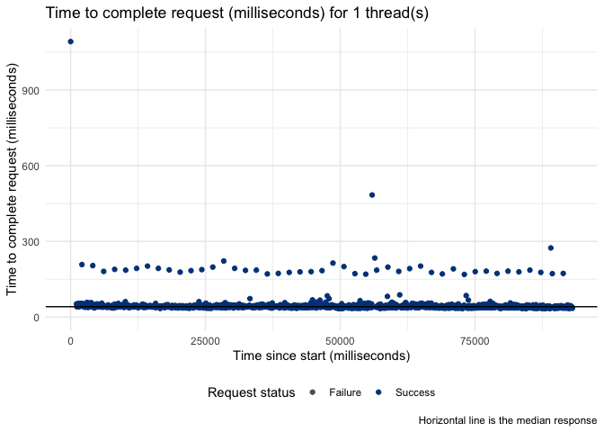
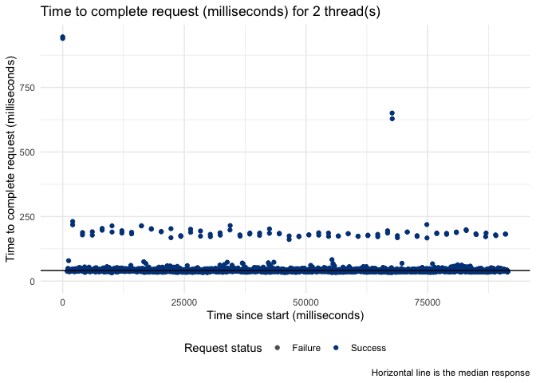
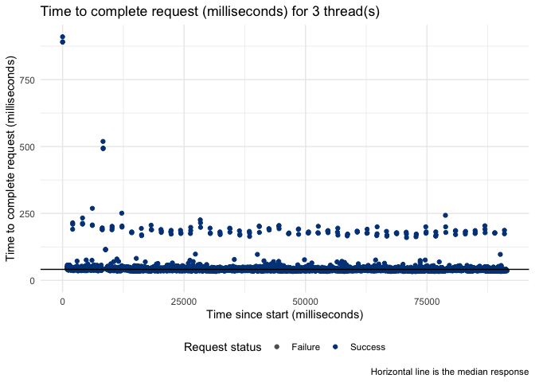
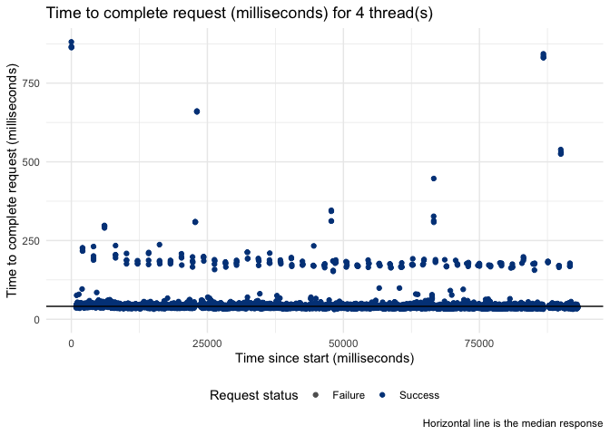
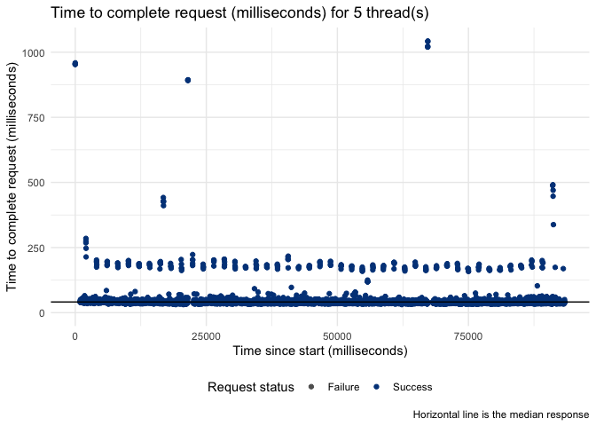
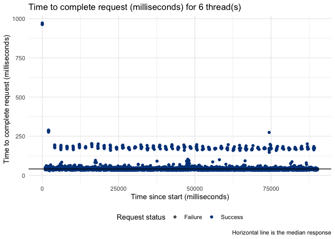
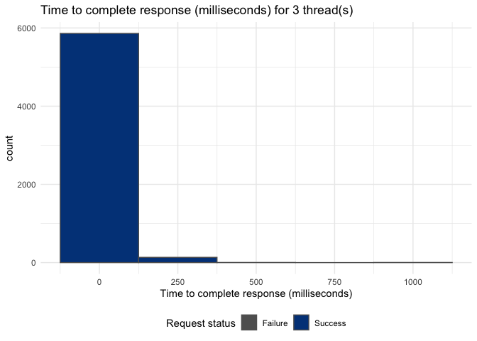
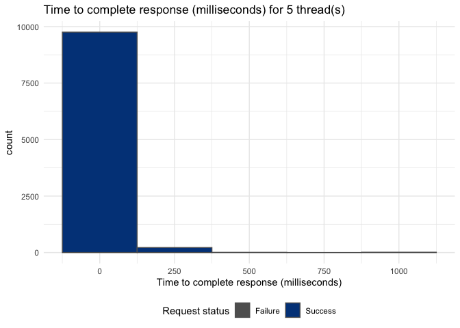

This documet contais some script to test the o2r API endpoint using the
`loadtest` [library](https://github.com/tmobile/loadtest).

Required libraries
------------------

    library("loadtest")

    ##  __         ______     ______     _____     ______   ______     ______     ______
    ## /\ \       /\  __ \   /\  __ \   /\  __-.  /\__  _\ /\  ___\   /\  ___\   /\__  _\
    ## \ \ \____  \ \ \/\ \  \ \  __ \  \ \ \/\ \ \/_/\ \/ \ \  __\   \ \___  \  \/_/\ \/
    ##  \ \_____\  \ \_____\  \ \_\ \_\  \ \____-    \ \_\  \ \_____\  \/\_____\    \ \_\
    ##   \/_____/   \/_____/   \/_/\/_/   \/____/     \/_/   \/_____/   \/_____/     \/_/
    ##                   :: loadtest - an R load testing framework ::

    library("ggplot2")
    library("dplyr")

    ## 
    ## Attaching package: 'dplyr'

    ## The following objects are masked from 'package:stats':
    ## 
    ##     filter, lag

    ## The following objects are masked from 'package:base':
    ## 
    ##     intersect, setdiff, setequal, union

    library("tidyr")

Other requirements
------------------

In order to use the `loadtest` library it is required to install Java
and Jmeter. Other requirements are described on the [installation
document](https://github.com/tmobile/loadtest#installation) of this
library.

Preparation
-----------

This documet contais some script to test the o2r API.

**Note:** This document is best run chunk by chunk, and not as a whole,
using RStudio. `loadtest` library requires the path to the jmeter bin
folder to work. You can add a file `.Renviron` on your local machine
next to this file, and it define the path in the environment variable
“LOADTEST\_JMETER\_PATH”. For more information about this local variable
refer to this
[guide](https://github.com/tmobile/loadtest#installing-jmeter).

    #Building DataSets

    #Configuration required to use 'loadtest' library, this system variable is stored in a .Renviron file. LOADTEST_JMETER_PATH="[path to jmeter bin folder]"

    #Sys.getenv("LOADTEST_JMETER_PATH")

Test
====

LoadTest o2r API entry point
----------------------------

The purpose of this test is to evaluate the performance of the o2r API
entry point simulating users making multiple request simultaneously.
Every test is going to be defined by a number of users (Threads) and the
number of requests per user (same number for every user). The
`test_threads` list define the number of users for test and
`request_num` the number of request per user. For example with
`test_threads = c(1,2)` and `request_num =500` there are going to be 2
tests, the first with one thread of 500 requests and the second one with
two threads of 500 requests per thread (i.e., 1000 request in total).

    # Define test
    test_threads<-c(1,2,3,4,5,6)
    # Define individual number of request
    request_num<-2000

    # List with the number of loops for each test scenario (per Thread). 

    number_loops<-rep.int(request_num,length(test_threads))

    # Run multiple consecutive tests

    test_variables  <- paste("Test_threads_",test_threads,sep="")
    test_functions<-paste0('loadtest(url = "https://o2r.uni-muenster.de/api/v1", method = "GET", threads =',test_threads,', loops=',number_loops,')')
    eq<-paste(paste(test_variables,test_functions,sep="<-"),collapse = ";")
    eval(parse(text=eq))

    #Save image of the current R environment

    save.image(file='datasets.RData')

Results
=======

Time to complete request over duration of test
----------------------------------------------

The elapsed time of each request of the course of the test.

    ListTest<-ls()
    ListTest<-ListTest[substring(ListTest,1,5)=="Test_"]

    plot_elapsed_times_o2r<-function(i){
       plot_test<-eval(as.name(i))
       plot<-plot_elapsed_times(plot_test)+scale_color_manual(values=c("#606060", "#004288"), drop=FALSE)+labs(title=paste0("Time to complete request (milliseconds) for ", max(plot_test$threads)," thread(s)"))
       return(print(plot))
    }

    for (f in ListTest){
      plot_elapsed_times_o2r(f)
     }

Distribution of time to complete responses
------------------------------------------

A histogram of the elapsed times

    plot_elapsed_times_histogram_o2r<-function(i){
       plot_test<-eval(as.name(i))
       plot<- plot_elapsed_times_histogram(plot_test)+scale_fill_manual(values=c("#606060", "#004288"), drop=FALSE)+labs(title=paste0("Time to complete response (milliseconds) for ", max(plot_test$threads)," thread(s)"))
       return(print(plot))
    }

    for (test in ListTest){
       plot_elapsed_times_histogram_o2r(test)
     }

\#\# TO DO:

More meaninful plots of the test:

-   Average time vs number of threads
-   Average Fail request vs number of threads
